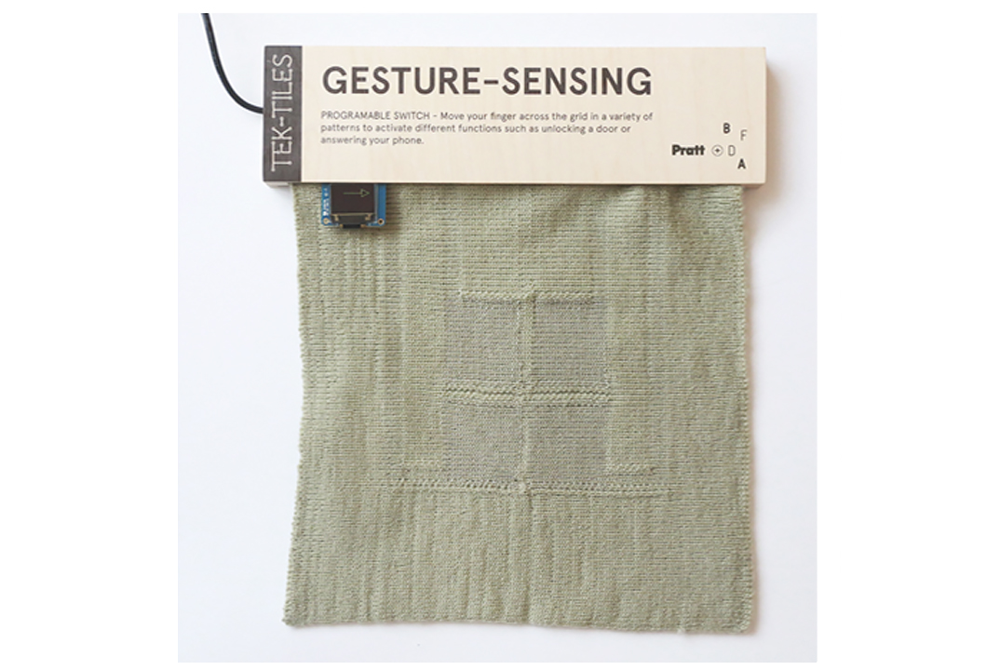

# Gesture Sensing TEK-TILE

Move your finger across the grid in a variety of patterns to activate different
functions such as unlocking a door or answering your phone.

[TEK-TILES](https://bkaccelerator.com/research-all/t-lab/tek-tiles/) is a
project from the [Brooklyn Fashion and Design
Accelerator](https://bkaccelerator.com) to develop examples of new textile
technologies.

